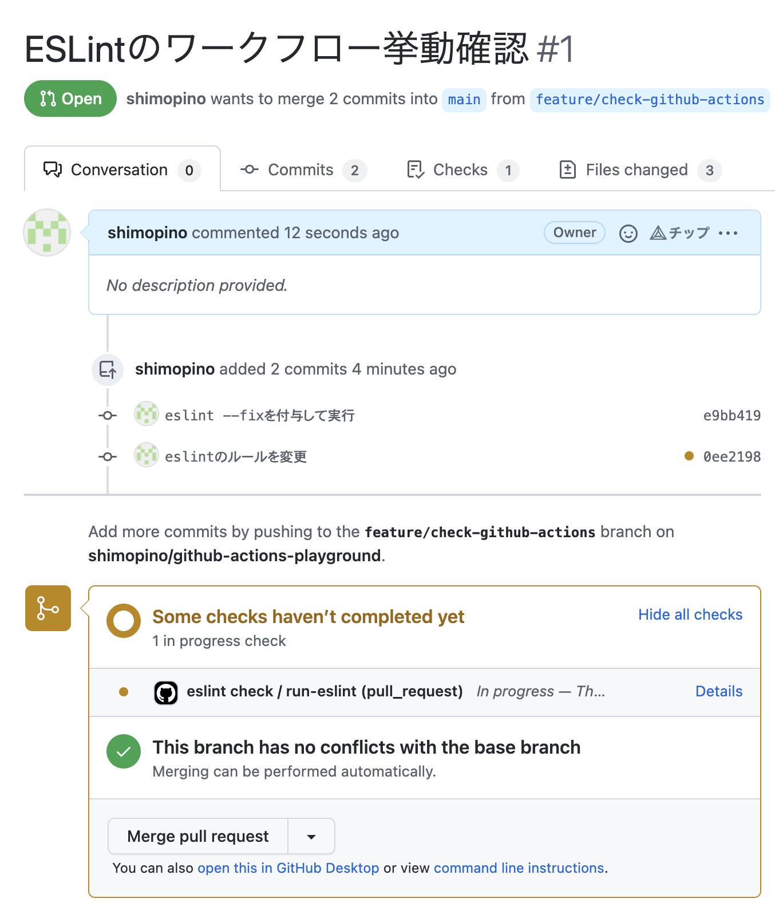
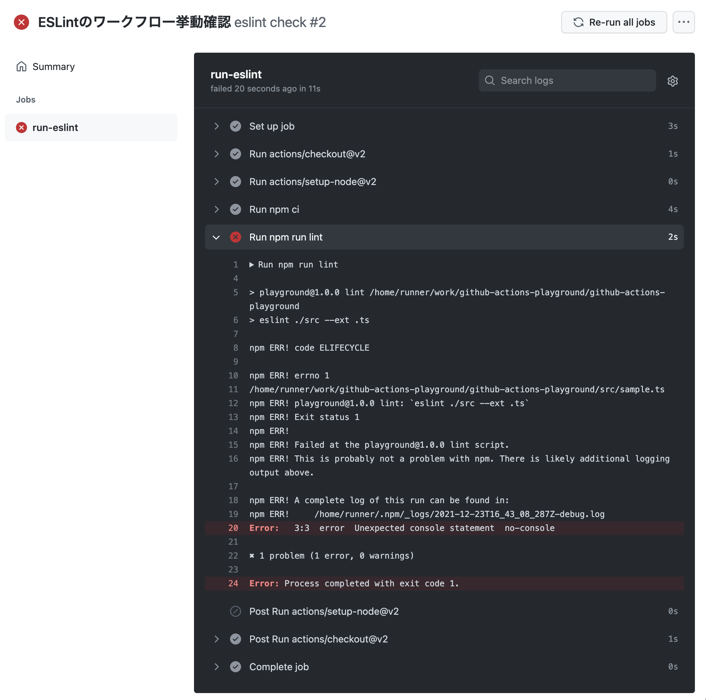
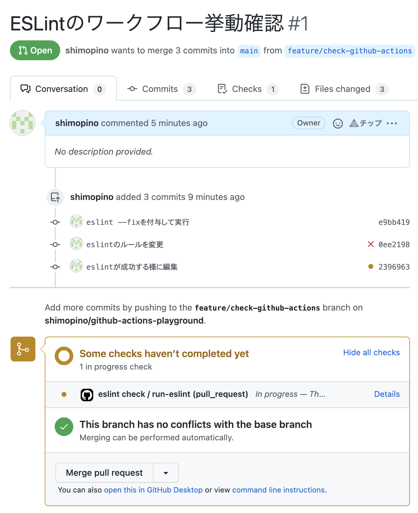
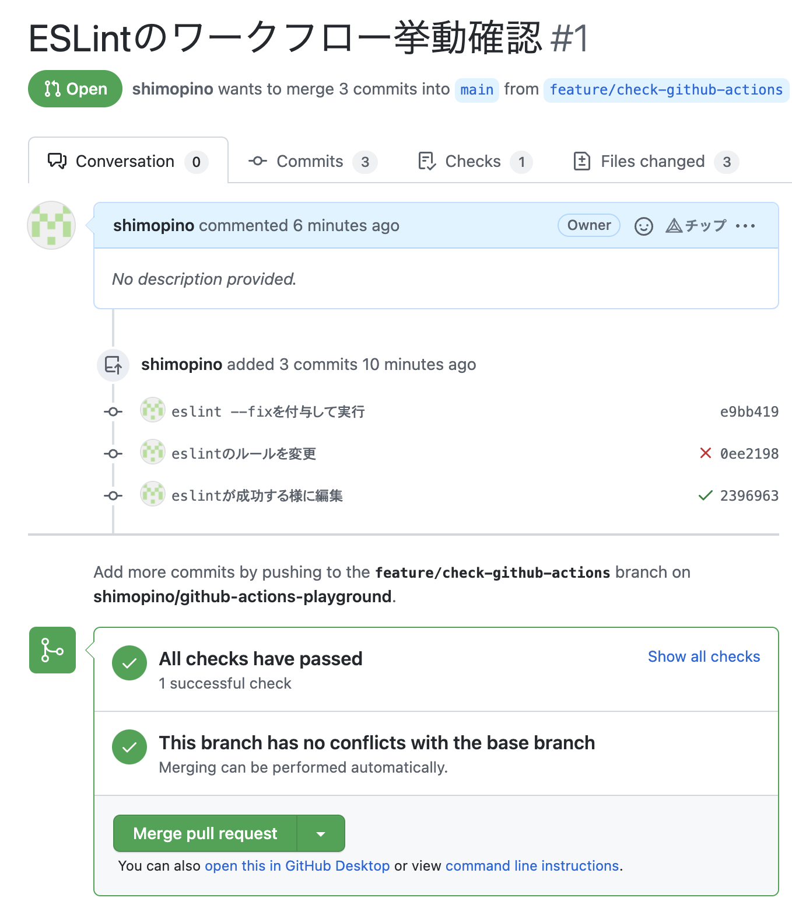

# github-actions-playgroun

## ESLint の前準備

Github Actions で自動的に ESLint を適用する実験を行うために、以下の条件で設定ファイルを作成する。

```bash
✔ How would you like to use ESLint? · style
node_modules
✔ What type of modules does your project use? · esm
✔ Which framework does your project use? · none
✔ Does your project use TypeScript? · No / Yes
✔ Where does your code run? · browser
✔ How would you like to define a style for your project? · guide
✔ Which style guide do you want to follow? · airbnb
✔ What format do you want your config file to be in? · JavaScript
```

これで以下の設定ファイルが作成される。

```js
module.exports = {
  env: {
    browser: true,
    es2021: true,
  },
  extends: ["airbnb-base"],
  parser: "@typescript-eslint/parser",
  parserOptions: {
    ecmaVersion: 13,
    sourceType: "module",
  },
  plugins: ["@typescript-eslint"],
  rules: {},
};
```

この状態で下記のサンプルファイルを作成する。

```ts
const name = "shimopino";

console.log(name);
```

これで ESLint を適用すると、以下の様に表示される￥。

```bash
❯❯❯ npx eslint sample.ts

/Users/shimopino/Desktop/praha/work/playground/sample.ts
  1:14  error    Strings must use singlequote                               quotes
  3:1   warning  Unexpected console statement                               no-console
  4:1   error    Too many blank lines at the end of file. Max of 0 allowed  no-multiple-empty-lines

✖ 3 problems (2 errors, 1 warning)
  2 errors and 0 warnings potentially fixable with the `--fix` option.
```

この出力結果を Github Actions で再現できる様にする。

## Github Actions

以下のワークフローを作成する。

```yml
name: eslint check

on:
  pull_request:
    types: [opened, reopened, synchronize]

jobs:
  run-eslint:
    runs-on: ubuntu-latest
    steps:
      - uses: actions/checkout@v2
      - uses: actions/setup-node
        with:
          node-version: "14"
      - run: npm ci
      - run: npm run lint
```

## プルリクを出す

ブランチを切って以下のコードの修正を行う。

```ts
{
  const name = "shimopino";
  console.log(name);
}
```

またワークフローで静的解析を実行した際にエラーを発生させるために、一時的にエラーとして報告されるようにルールの変更をおこなっておく。

```js
rules: {
  "no-console": "error",
},
```

これでプルリクを作成すると、以下の様にワークフローが起動していることがわかる。



実際にワークフローのログを確認すると、ESLint のルール変更に合わせて、静的解析が失敗していることがわかる。



ここで ESLint が成功する様に、コードを以下の様に編集する。

```ts
{
  const name = "shimopino";
  name.toLowerCase();
  // console.log(name)
}
```

ここで再度コミットをプッシュすると、自動的にワークフローが起動していることがわかる。



静的解析が成功すれば以下の様に、全ての検査項目をパスしていることがわかる。


